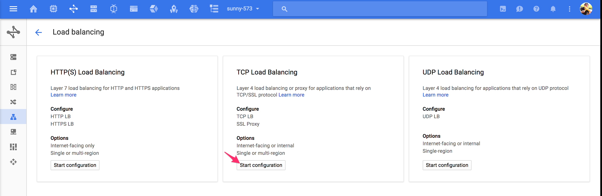
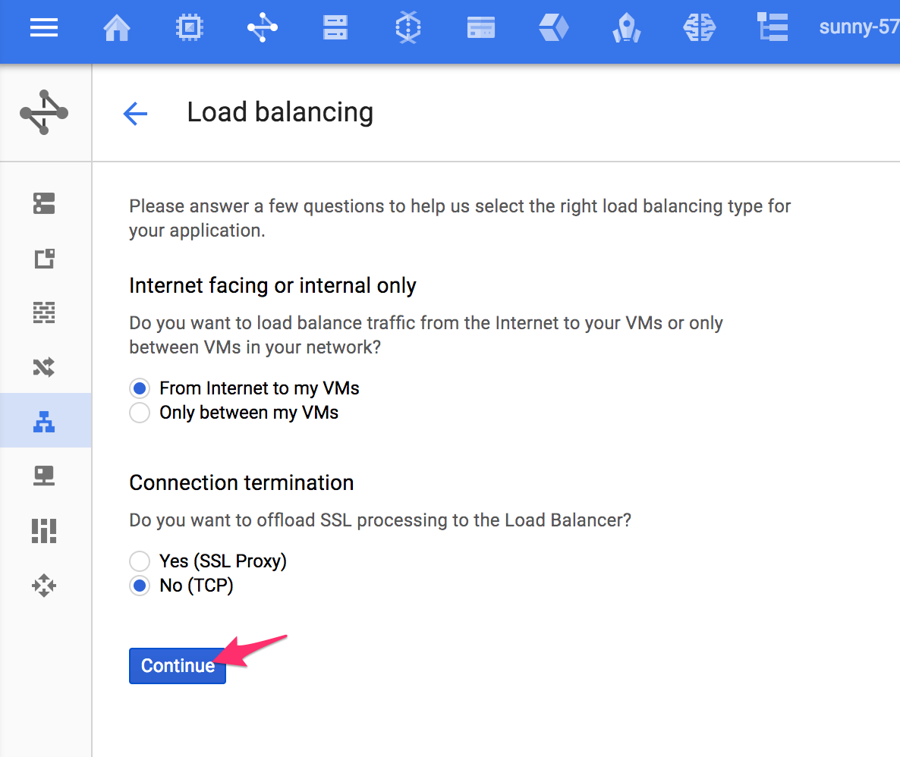
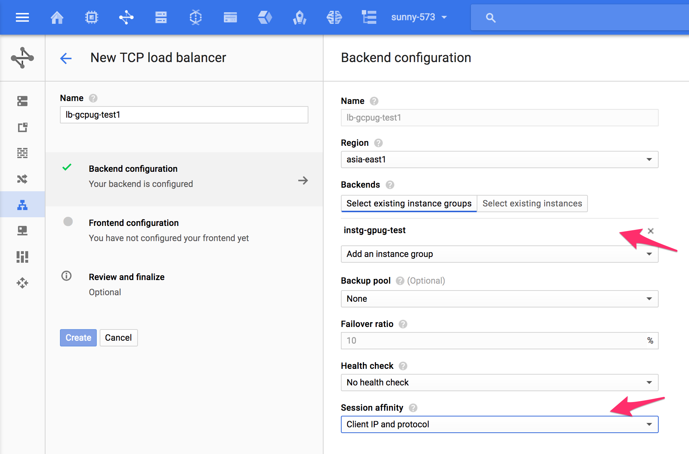
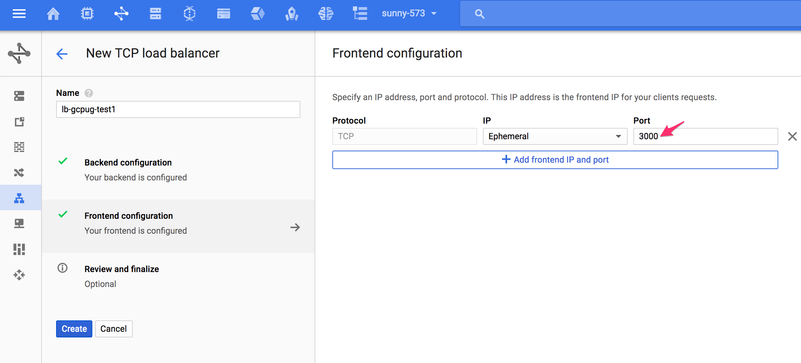
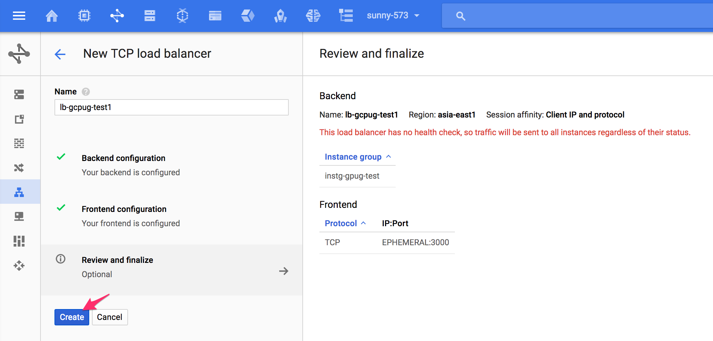

# GCE deployment

## After server work well

After [prepare your code](README.md) section, you should have a linux that ready for a 3000 port connect web. Here is the deploy flow that should do in GCE deployment...

* Open firewall

```
gcloud compute firewall-rules create --allow tcp:3000 --network "default" --target-tags "allow-3000port"
```

* Create image 

```
gcloud compute images create --source-disk "instance-1" --source-disk-zone "asia-east1-b"
```

* Create instance template

```
gcloud compute instance-templates create "inst-gcpug-test" \
  --machine-type "n1-standard-1" \
  --network "default" \
  --maintenance-policy "MIGRATE" \
  --tags "allow-3000port" \
  --image "/sunny-573/img-gcpug-test" \
  --boot-disk-size "10" \
  --boot-disk-type "pd-standard" \
  --boot-disk-device-name "inst-gcpug-test"

```

* Create instance group

```
gcloud compute instance-groups managed create "inst-gcpug-test" \
  --zone "asia-east1-b" \
  --base-instance-name "inst-gcpug-test" \
  --template "inst-gcpug-test" \
  --size "1"

gcloud compute instance-groups managed set-autoscaling "inst-gcpug-test" \
  --zone "asia-east1-b" \
  --cool-down-period "60" \
  --max-num-replicas "10" \
  --min-num-replicas "1" \
  --target-cpu-utilization "0.6"
```


## Add instance group to load balancer

After instance group done, you can add instance group to load balancer...

Step1: Select TCP Load Balancer 


Step2: Select External Load Balancer


Step3: Setup backend server


Step4: Setup frontend ip and port


Step5: Check and submit


## Check

If everything ok, you will get an ip address from load balancer. And you can use your service :D

